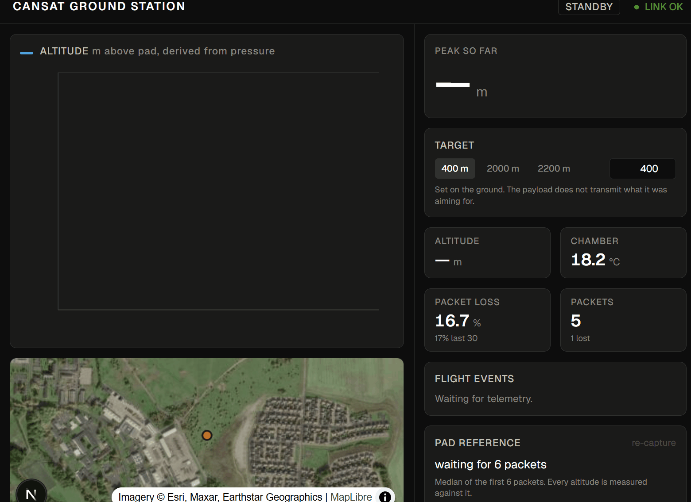
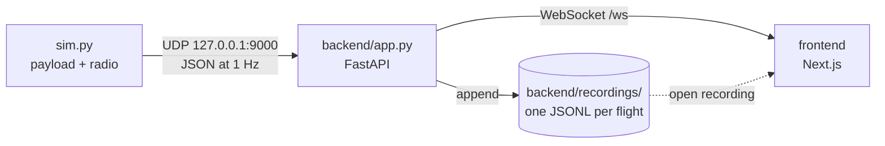
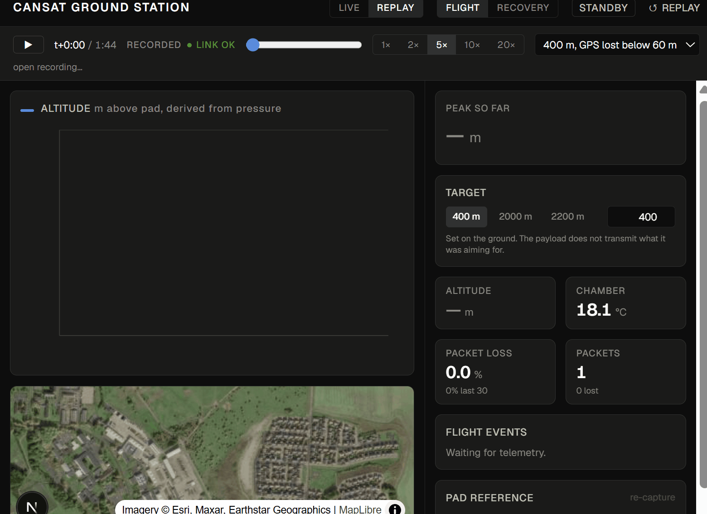
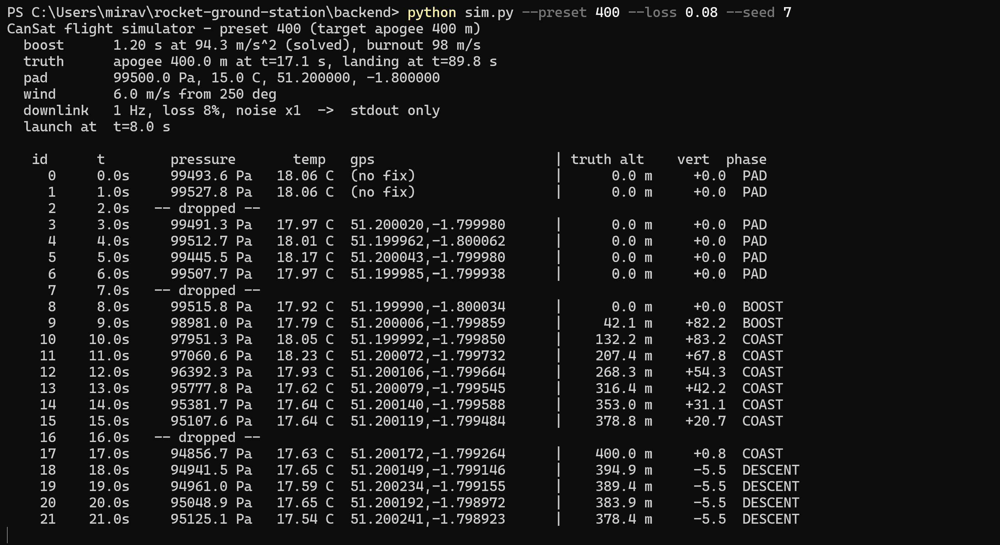
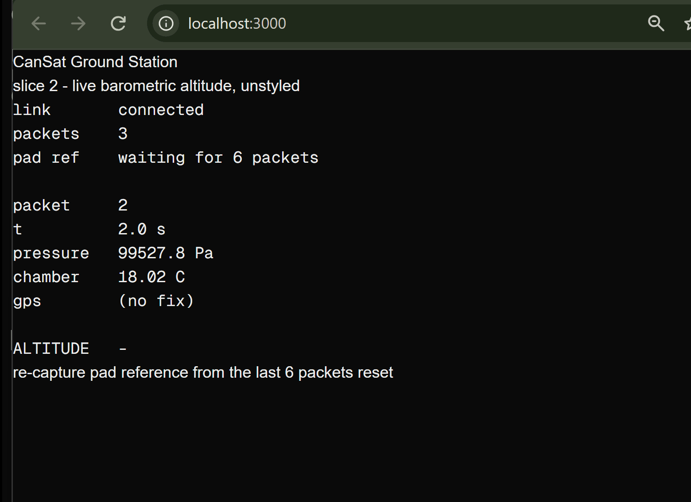
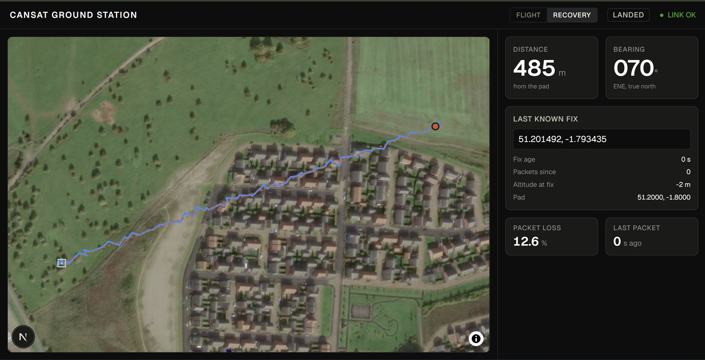

# CanSat Ground Station

Receive-only ground station for a rocket-borne CanSat payload: a Next.js dashboard, a FastAPI receiver, and a Python flight simulator standing in for the payload and its 1 Hz radio downlink.



*The 400 m preset, launch to apogee. Altitude is derived on the ground from pressure; every dot is one received packet, and gaps are dropped packets.*

- Derives altitude from barometric pressure against a pad reference measured before launch. The downlink carries no altitude.
- Detects apogee on noisy 1 Hz data and compares the peak against a target entered on the ground.
- Reports link health from the packet counter: loss over the flight and over the last 30 packets, and OK / DEGRADED / LOST from the age of the newest packet.
- Tracks GPS and gives bearing and distance from the pad to the last known fix, flagging when that fix is not the landing site.
- Records every flight, and replays any recording in the browser with the backend stopped.

There is no command path: no uplink, no waypoints, no vehicle configuration. The backend opens a socket and listens.

## Architecture



- **The simulator is a separate process sending UDP**, so the backend is a genuine receiver: stopping the sim produces a real link loss, and a flight can be restarted without restarting anything else. The UDP send is where a serial LoRa modem would attach.
- **The backend receives, records and fans out, and never interprets.** Every packet is pushed to every connected browser rather than sampled - at 1 Hz there are about ten packets between launch and apogee, and one skipped packet changes the curve apogee is read from. A browser that connects mid-flight is first sent the whole flight so far, because altitude cannot be derived without the pad packets.
- **All derivation runs in the browser**, as pure functions in `frontend/app/lib/`. `deriveFlight(packets, now_s)` recomputes everything from the full packet list on every call; at a few hundred packets that is free. Live mode and replay call the same function, so they cannot drift apart.

## Downlink format (v1)

| Field | Unit | |
|---|---|---|
| `schema` | | `1` |
| `packet_id` | | Counter. Advances whether or not the packet gets through. |
| `pressure_pa` | Pa | Static pressure. |
| `temp_c` | °C | Chamber temperature, inside the payload. Never used for altitude. |
| `lat_deg`, `lon_deg` | degrees | Absent until GPS lock, and can disappear again. |

Flat JSON, SI units, the unit in every field name. There is no altitude and no timestamp: mission time is `packet_id / rate`, so a dropped packet leaves a gap of exactly the right length on the time axis, where receive time would let radio jitter stretch the profile. The format only grows by adding optional fields, so recordings stay playable.

## Running it

Python 3.12 and Node 24. One-off setup:

```
cd backend
python -m venv .venv
.venv\Scripts\activate            # macOS / Linux: source .venv/bin/activate
pip install -r requirements.txt

cd ../frontend
npm install
```

### Live

Three terminals:

```
# 1. receiver - venv active; WebSocket on :8000, UDP on :9000
cd backend
uvicorn app:app

# 2. dashboard - http://localhost:3000
cd frontend
npm run dev

# 3. payload
cd backend
python sim.py --preset 400 --udp 127.0.0.1:9000
```

`sim.py` is standard library only, so it needs no venv.

### Replay

Only `npm run dev`. Click **REPLAY**: a recorded flight is bundled (400 m preset, GPS lost below 60 m), and **open recording…** loads any file from `backend/recordings/`. Transport controls play, pause, seek and run at 1-20×.



*Replay with the backend stopped. The header reads REPLAY; the link state beside the playhead is the one recorded at that point in the flight.*

## Simulator



*`python sim.py --preset 400 --loss 0.08 --seed 7`. Right of the `|` is the simulator's ground truth, which is not transmitted.*

- **Presets 400 m, 2000 m and 2200 m.** Boost acceleration is solved by bisection at startup so each flight actually peaks at its target, which is what makes the peak-vs-target readout honest.
- **The pad is not at sea level**: 99500 Pa, about 150 m up. Assuming 101325 Pa would put every altitude out by that much, so the pad calibration has to be real.
- **Default sensor noise is 25 Pa (about 2 m).** Not a datasheet figure - it is the aerodynamic pressure fluctuation a barometer sees inside a moving airframe, and it is what makes apogee detection hard.
- **8 s on the pad before launch, 15 s of transmission after landing**: the pad packets are the only chance to measure the reference pressure, and the post-landing fixes give the recovery view stationary positions to settle on.

| Option | Default | |
|---|---|---|
| `--preset` | `400` | `400`, `2000` or `2200` |
| `--udp HOST:PORT` | off | Also send each packet over UDP. |
| `--loss` | `0` | Packet loss probability. |
| `--noise` | `1` | Sensor noise multiplier. |
| `--seed` | random | Repeatable runs. |
| `--speed` | `1` | Pacing multiplier; `0` runs as fast as possible. |
| `--gps-dropout-below M` | off | Lose GPS lock below M metres on the way down, for good. |
| `--pad-temp` | `15` | °C. Raise it to introduce the error a real barometric solution carries. |
| `--fixture PATH` | off | Write the transmitted packets plus ground truth to JSON. |

`python sim.py --help` lists the rest: rate, pad pressure and position, wind, pad hold, post-landing time, GPS lock delay and quiet mode.

## Derivations

Pure TypeScript in `frontend/app/lib/`. The files import each other with explicit `.ts` extensions, so each one also runs directly under Node.

### Altitude - `barometric.ts`

The ISA troposphere barometric formula, inverted and referenced to the pad:

```
h = (T_pad / L) * (1 - (p / p_pad) ^ (R * L / (g * M)))
```

- `p_pad` is the median of the first 6 packets. A median rather than a mean, because it discards an outlier completely. A **re-capture** control takes it from the most recent packets instead, for a page opened after the pad packets went past.
- `T_pad` is ISA standard, 15 °C. Never the chamber temperature: that is measured inside a sealed enclosure warmed by its own electronics, and would bias every altitude.
- Exact against ISA pressures from 0 to 3000 m. Where it breaks: the lapse rate is a standard-day assumption (a 27 °C pad reads about 88 m low at 2200 m), it is troposphere-only, and it treats the pad pressure as constant for the flight.



*The first altitude derived end to end - simulator, UDP, backend, WebSocket, browser - before the dashboard existed.*

### Apogee - `apogee.ts`

The obvious detector, "the first sample lower than the one before", fires on the launch pad: at rest, the sign of each difference is decided by noise. This one:

1. **Arms** only once the payload has climbed past 20 m.
2. **Decides on a 3-sample moving median**, so one noisy packet cannot make the call. Wider costs too much: the 400 m ascent is only about ten packets.
3. **Requires 3 consecutive descending** smoothed samples.
4. **Backdates** to the highest *raw* sample at or before that point. A median across the peak sits below it by construction, so the smoothed series is the right thing to decide with and the wrong thing to report. This is worth about three times more accuracy than any other refinement; a parabola fit through the peak was measured and adds nothing.
5. **Latches**. Once declared, it never changes.

Backdating decouples accuracy from latency: the run length changes when apogee is known, never what is reported.

`npm run check:apogee` scores it against six committed simulator flights with known truth:

| Fixture | Noise | Loss | Altitude error | Time error | Declared after |
|---|---|---|---|---|---|
| 400-clean | 0 | 0% | 0.0 m | -0.1 s | 4 s |
| 400-typical | 1 | 10% | +0.3 m | -0.1 s | 3 s |
| 400-harsh | 2 | 30% | +2.8 m | +0.9 s | 6 s |
| 2200-clean | 0 | 0% | -0.8 m | +0.1 s | 3 s |
| 2200-typical | 1 | 10% | -0.6 m | +0.1 s | 4 s |
| 2000-harsh | 2 | 30% | -2.8 m | -0.8 s | 8 s |

On the same data the naive detector fires on the pad in four of the six.

### Link health - `link.ts`

- Loss is counted from gaps in the packet counter, the only evidence a lost packet ever existed. It is reported for the whole flight and over the trailing 30 packets, which is the figure that shows the link degrading now.
- Link state comes from the age of the newest packet: **OK** up to 3.5 s, **DEGRADED** to 12 s, **LOST** beyond. At 1 Hz two consecutive drops age the newest packet to 3 s, so ordinary loss never flaps the indicator.
- Age is measured on the stream clock passed in as `now_s`, never `Date.now()`. Live mode advances it with the wall clock between packets, so staleness keeps climbing during a dropout; replay passes the playhead.

### Flight events - `flight.ts`

PAD, LAUNCH (first sample at 10 m), APOGEE and LANDED (back below 15 m after apogee), and the current phase. The pad position is the median of the GPS fixes taken before launch.

### Recovery - `recovery.ts`



*Bearing and distance from the pad to the last known fix, with that fix's age, the packets received since, and the altitude it was taken at.*

- Haversine distance and initial great-circle bearing, plus a 16-point compass label.
- **The last known fix is not the last packet.** GPS loses lock long before the radio link does, so the newest position can be much older than the newest packet. Above 15 m at the last fix, or more than 3 packets since, the view marks itself suspect and says the distance is a lower bound. With GPS lost at 60 m on descent, the last fix reads 417 m from the pad against a true landing at 491 m.

## Recording and replay

- The backend appends every packet to `backend/recordings/flight-<UTC>.jsonl`: one file per flight, one packet per line, exactly as broadcast. A `packet_id` going backwards means the payload restarted, and starts a new file.
- Each packet is opened, appended and closed. At 1 Hz that costs nothing, and stopping the backend mid-flight loses nothing.
- Replay holds the whole recording and passes the packets received by the playhead, with the playhead as `now_s`, to the same `deriveFlight`. Apogee is declared, the link degrades and GPS drops out at the moments they did live, and seeking backwards is a shorter slice.
- Loading applies the backend's validation. Unreadable lines are skipped and counted; a counter that goes backwards means two flights in one file and is refused.
- To bundle a recording, copy it into `frontend/public/flights/` and add it to `BUNDLED_FLIGHTS` in `frontend/app/page.tsx`.

## Tests

```
cd frontend
npm run check:apogee
```

Plain Node, with no test framework, build step, backend or Python. Beyond the scores above it checks that apogee never changes once declared, and prints the naive detector for comparison. Fixtures are `sim.py --fixture` output in `frontend/fixtures/`; add one by writing a flight there and adding its name to `FIXTURES` in `frontend/scripts/check-apogee.mts`.

## Layout

```
backend/
  app.py              UDP receiver, recorder, WebSocket fan-out
  telemetry.py        packet validation
  sim.py              flight simulator, standard library only
  recordings/         flight recordings (gitignored)
frontend/
  app/page.tsx        dashboard: live / replay, flight / recovery
  app/components/     AltitudeChart, FlightMap
  app/lib/            telemetry, barometric, apogee, link, flight, recovery, recording
  fixtures/           simulator flights with ground truth
  scripts/            check-apogee.mts
  public/flights/     bundled replay recordings
  public/maplibre-gl-*.mjs   MapLibre worker, vendored
docs/media/           captures
```

## Notes

- **MapLibre under Turbopack.** MapLibre derives its worker URL from `import.meta.url`, which is not an http(s) URL inside a Turbopack chunk, so it silently starts a worker from an empty URL. The stock worker is served from `frontend/public/` via `setWorkerUrl`; re-copy both `.mjs` files from `node_modules/maplibre-gl/dist` on any upgrade.
- **The basemap is Esri satellite imagery**, declared as an inline raster style. Raster tiles decode on the main thread, clear of the worker path, and field boundaries and tree lines are the landmarks when walking to a landing site in open ground.
- **Against real hardware**, using the packet counter as the clock stops being exact once transmit jitter and payload clock drift appear; the remedy is a payload timestamp added as an optional field.
- The full decision log is in [CLAUDE.md](CLAUDE.md), and every problem hit and how it was solved in [NOTES.md](NOTES.md).
